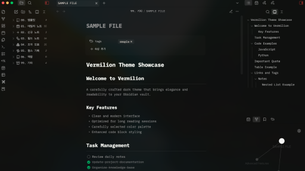
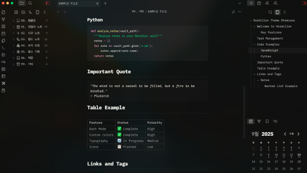
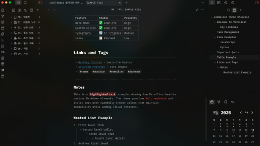

# Vermilion

A dark theme for Obsidian.

## Installation

### From Obsidian

1. Open Settings → Appearance → Themes
2. Click "Manage" button
3. Search for "Vermilion"
4. Click "Install and use"

### Manual Installation

1. Download `theme.css` and `manifest.json` from this repository
2. Create a folder called `Vermilion` in your vault's `.obsidian/themes/` directory
3. Place the downloaded files in the `Vermilion` folder
4. Open Settings → Appearance → Themes
5. Select "Vermilion" from the dropdown menu

## Screenshot

## Support

-   Report issues: [GitHub Issues](https://github.com/vigor-13/vermilion-theme/issues)
-   Author: [@vigor-13](https://github.com/vigor-13)

## License

This theme is licensed under the [MIT License](LICENSE).
